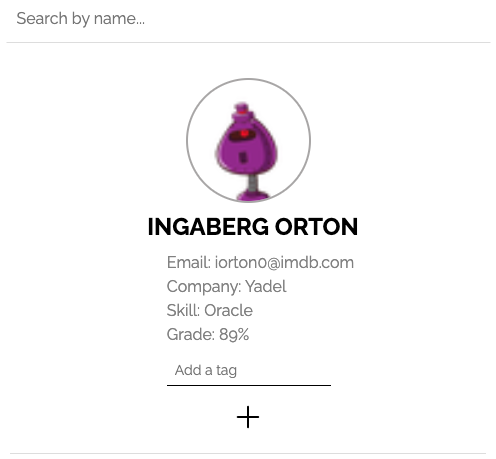

# hatchways_ReactApp

### _This application is Celeste Moore's Hatchways Front-End Assessment recreated with React for practice._

## Table of Contents

- [Media](#Media)

- [Deployed Site](#deployed-site)

- [Features](#Features)

- [Contributors](#Contributors)

- [Contact](#Contact)

- [Project Status](#project-status)

- [License](#License)

## Media

Full-Width View:  

Mobile View:  

## Deployed Site

Coming soon to a device near you!

## Features
    - Single-page application built with HTML, CSS and React and JavaScript.
    - Bootstrap and Bootstrap Icons.

## Contributors

This application was created by Celeste Moore.

## Contact

If you have any questions about this repository, contact celestealexmoore via GitHub or reach out via email:
celestealexmoore@gmail.com.

## Project Status

Completed

---

## License

© 2021 _celestealexmoore_